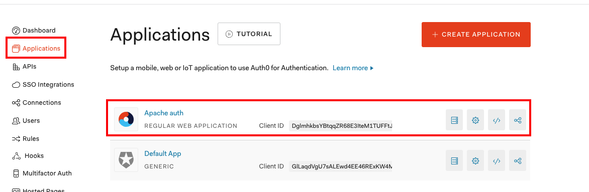
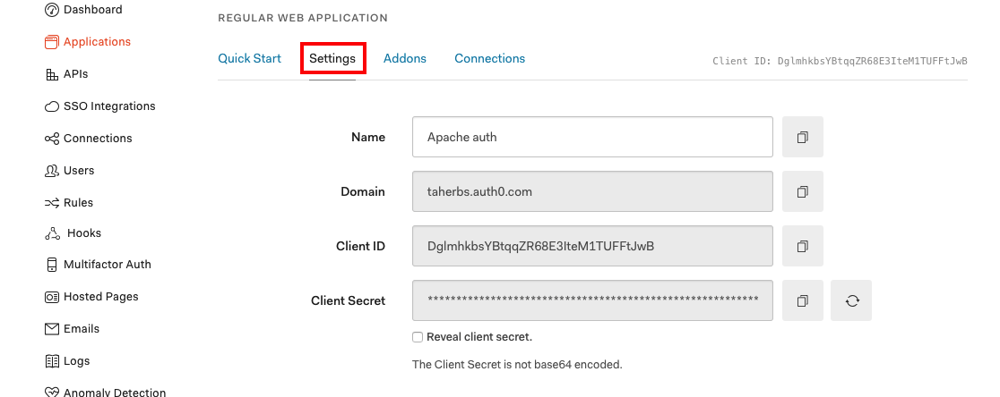
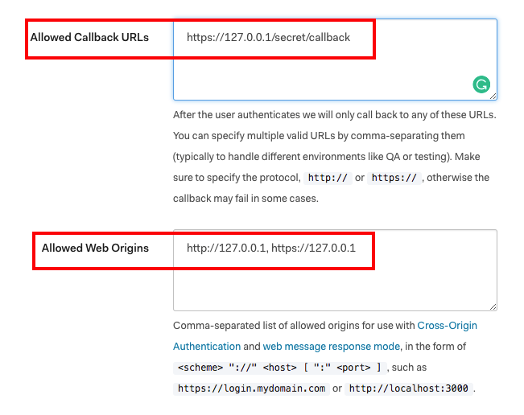
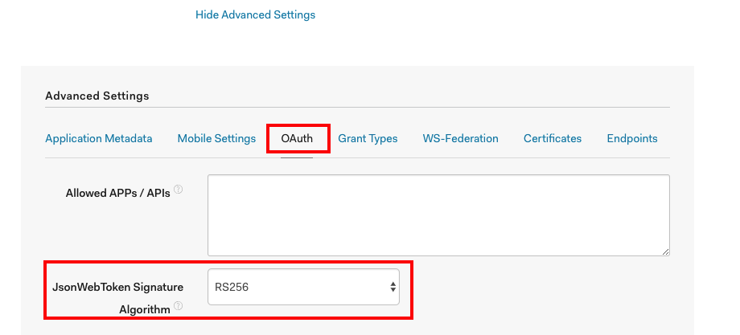

## Apache2 Auth0 mod_auth_openidc - Docker

Apache web server with Auth0 authentication/authorization mechanism using [mod_auth_openidc](https://github.com/zmartzone/mod_auth_openidc).

### Prerequisites:
* [Docker](https://docs.docker.com/install/)

### Configure Auth0 Account
1- If you don't already have an Auth0 Account, create one [here](https://auth0.com/) and set up the type of connections/users you want to allow.

2- Create a new application.

|  |  |
|:---:|:---:|

3- Go yo your application **settings** add a new entry to **Allowed Callback URLs** equal to the <code>OIDC_REDIRECT_URL</code> param you will set later in the **env_vars** file. Then, go to OAuth section in advanced settings and change <code>JsonWebToken Token Signature Algorithm</code> to <code>RS256</code>.

|  |  |
|:---:|:---:|

|  |  |
|:---:|:---:|

**Note:** You can as well use one of your existing applications just make sure that your application settings is set properly.

### Setup project env vars:
Create and update properly the env_vars file
```bash
# Create the env_vars from the existing sample file 
cp env_vars.sample env_vars
```

### Usage
Start Application
```bash
make start
```
