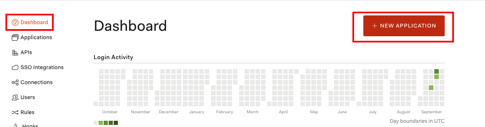
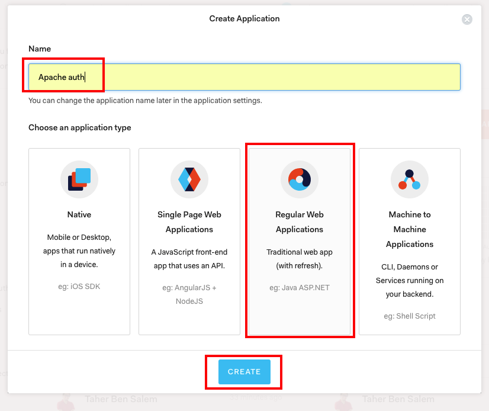

## Apache2 Auth0 mod_auth_openidc - Docker

Apache web server with Auth0 authentication/authorization mechanism using [mod_auth_openidc](https://github.com/zmartzone/mod_auth_openidc).

**Note:** This project contains 2 dockerfile defining the plaform for [Centos](https://github.com/taherbs/apache2-mod_auth_openidc/Dockerfile-centos) and [Ubuntu16.04](https://github.com/taherbs/apache2-mod_auth_openidc/Dockerfile-ubuntu) based plaforms.

### Prerequisites:
* [Docker](https://docs.docker.com/install/)

### Configure Auth0 Account
1- If you don't already have an Auth0 Account, create one [here](https://auth0.com/) and set up the type of connections/users you want to allow.

2- Create a new application.

|  |  |
|:---:|:---:|

3- Go yo your application **settings** add a new entry to **Allowed Callback URLs** equal to the `OIDC_REDIRECT_URL` param you will set later in the **[env_vars](https://github.com/taherbs/apache2-mod_auth_openidc/env_vars)** file. Then,  in **advanced settings** go to the **OAuth** section and change `JsonWebToken Token Signature Algorithm` param to`RS256`.

|  |  |
|:---:|:---:|

|  |  |
|:---:|:---:|

**Note:** You can as well use one of your existing applications just make sure that your application settings is set properly.

### Setup project env vars:
Update the [env_vars](https://github.com/taherbs/apache2-mod_auth_openidc/env_vars) file properly.


### Usage
Start Application
```bash
make start
```

### Change Makefile Container platform
By default the make file is automating the deployment of the [Centos](https://github.com/taherbs/apache2-mod_auth_openidc/Dockerfile-centos) version of the project.
If you want to change that and deploy the [Ubuntu16.04](https://github.com/taherbs/apache2-mod_auth_openidc/Dockerfile-ubuntu) version, update the [Makefile](https://github.com/taherbs/apache2-mod_auth_openidc/Makefile#L6) `PLATFORM` variable to "ubuntu".

### Test
In your browser try accessing "https://127.0.0.1" - The page should load normally (no auth).<br>
In your browser try accessing "https://127.0.0.1/secret" - You should get redirect to the auth0 authentication page.

